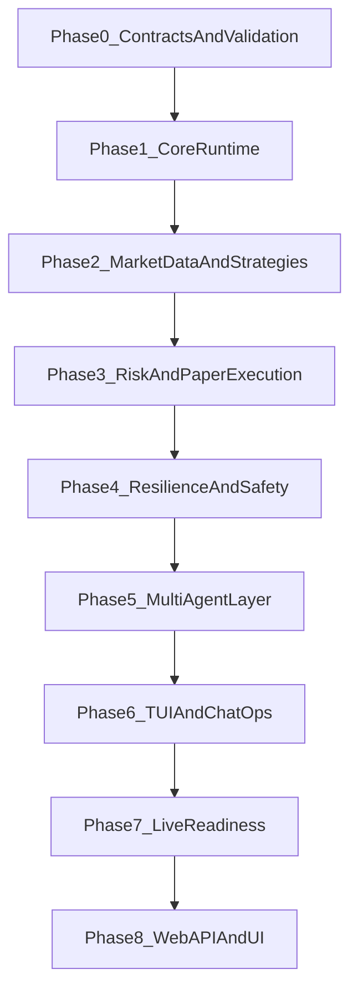

# Cerebro App Build Plan

## Scope Lock

- **MVP market scope:** Full Binance markets in MVP (Spot + major Futures set).
- **Delivery priority:** CLI + ChatOps first; Web API/UI deferred to Phase 2.
- **Primary references:** [/Users/azhar/Documents/Coding/cerebro/PRD.md](/Users/azhar/Documents/Coding/cerebro/PRD.md), [/Users/azhar/Documents/Coding/cerebro/TECHNICAL_DESIGN.md](/Users/azhar/Documents/Coding/cerebro/TECHNICAL_DESIGN.md), [/Users/azhar/Documents/Coding/cerebro/configs](/Users/azhar/Documents/Coding/cerebro/configs).

## Phase 0 - Baseline and Contract Alignment

- Lock module/repo conventions, Go version, and package boundaries (`cmd` -> `app` -> `domain/port` -> `adapter`).
- Normalize config contracts and examples:
  - Align symbol universe between [/Users/azhar/Documents/Coding/cerebro/configs/strategies.yaml.example](/Users/azhar/Documents/Coding/cerebro/configs/strategies.yaml.example) and [/Users/azhar/Documents/Coding/cerebro/configs/markets.yaml.example](/Users/azhar/Documents/Coding/cerebro/configs/markets.yaml.example).
  - Enforce environment triple agreement (`ENVIRONMENT`, CLI mode, `app.yaml` environment).
- Define a startup validation gate (`cerebro check --dry-run`) for schema + cross-file checks before runtime.

## Phase 1 - Core Runtime Skeleton (No Live Trading)

- Build composition root and lifecycle management:
  - Cobra commands (`run`, `check`, `backtest`) with context cancellation and graceful shutdown.
  - Structured logging (`slog`) and typed config loading/validation.
- Implement core domain and ports first (signals, intents, positions, risk decisions, broker/cache/store interfaces).
- Stand up persistence primitives:
  - Postgres migrations (`order_intents`, `trades`, `agent_runs`, `agent_messages`, `audit_events`).
  - Redis key conventions for quotes, bias, dedup, rate limits, and halts.
- Deliverable: app boots, validates config, initializes dependencies, and passes health checks.

## Phase 2 - Market Data + Strategy Engine

- Implement Binance Spot/Futures market-data adapters (WS-first, REST fallback) and market-data hub fan-out.
- Build candle/indicator pipeline and strategy execution loop for configured symbols/timeframes.
- Add signal dedup and warmup safeguards from strategy config.
- Deliverable: deterministic signal generation in paper mode with replay test coverage.

## Phase 3 - Risk Gate + Paper Execution Path

- Implement numeric risk gate (position sizing, max exposure, drawdown/kill-switch checks) independent of LLM.
- Build idempotent order-intent workflow and paper execution matcher.
- Introduce per-venue execution worker (single writer pattern), order state transitions, and trade persistence.
- Deliverable: end-to-end paper trading (signal -> risk -> intent -> simulated fills -> persisted/auditable outcomes).

## Phase 4 - Resilience and Operational Safety

- Add reconnect/backoff, watchdog startup reconciliation, and fail-safe halt semantics.
- Implement Binance rate-limit governance (weights/orders/WS) with Redis-backed counters.
- Add order monitor for trailing stop / partial take-profit management.
- Deliverable: restart-safe, recoverable paper system with reconciliation + halt controls validated.

## Phase 5 - Multi-Agent Layer (Screening, Risk, Copilot, Reviewer)

- Implement LLM abstraction and provider fallback order from config.
- Add Screening Agent (scheduled bias cache), Risk Agent (approve/veto/sizing), and Copilot (`/ask`).
- Add Reviewer as asynchronous advisory workflow producing config diff suggestions (no auto-apply in V1).
- Add tool-call boundaries and timeout/circuit-breaker behavior so LLM failures cannot increase risk.
- Deliverable: AI-assisted decision pipeline with auditability and deterministic fallback behavior.

## Phase 6 - Operator Experience (CLI TUI + ChatOps)

- Implement Bubble Tea dashboard over internal event bus (positions, orders, market state, agent logs).
- Build command dispatcher and adapters for Telegram/Discord with RBAC/allowlist + audit logging.
- Implement operational commands (`/status`, `/pause`, `/resume`, `/flatten`, `/positions`, `/bias`, `/ask`).
- Deliverable: production-usable operational control plane without web UI.

## Phase 7 - Live Readiness and Rollout

- Add staged rollout controls: paper soak, constrained live canary, then full market enablement.
- Enforce risk budgets, API key scopes, secret management, retention/backups, and incident runbooks.
- Establish SLO baselines (startup recovery, order lifecycle latency, command-response latency) and alert thresholds.
- Deliverable: controlled go-live checklist and repeatable runbook for operations.

## Phase 8 - Phase 2 Web Surface (Deferred)

- Add HTTP API (Chi) exposing positions/orders/agent logs/health.
- Build web dashboard (React/Next) using API parity with TUI views.
- Keep trading authority in core engine; web remains an operator/client layer.

## Build Dependency Flow

## Acceptance Gates Per Phase

- Every phase ends with:
  - automated tests (unit + targeted integration/replay),
  - updated operator documentation,
  - `check --dry-run` passing,
  - no regression to safety invariants (paper isolation, halt controls, reconciliation correctness).

## Highest-Risk Items to De-Risk Early

- Futures/spot symbol and credential matrix correctness across configs.
- Startup reconciliation correctness between broker truth and local persisted state.
- Rate-limit behavior under burst market conditions.
- LLM timeout/fallback behavior that guarantees “no added risk on AI failure.”
