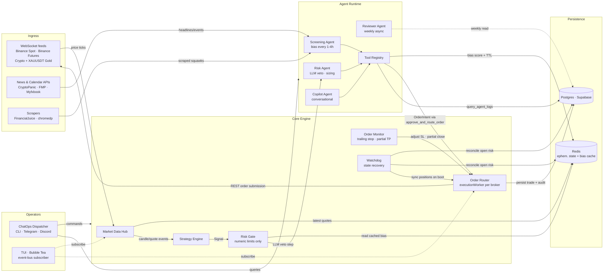

# Technical Design Document: Project Cerebro

**Version:** 1.4  
**Aligned with:** PRD v2.3  
**Language / runtime:** Go 1.22+ (module: `github.com/<org>/cerebro`)  
**Last updated:** 2026-04-12

> This document is the implementation companion to `PRD.md`. It covers architecture, package layout, concurrency model, persistence schema, key interfaces, and operational contracts. Every section maps back to at least one PRD section.

---

## 1. Design principles

| Principle | Implication |
|-----------|-------------|
| **Safety first** | `ENVIRONMENT=LIVE` must be set deliberately; paper/sim is the default. Numeric risk limits in `risk/gate.go` are enforced in pure Go — they never depend on an LLM being responsive. |
| **Explainability** | Every `OrderIntent` carries a `correlation_id` traceable to its `Signal`, agent decisions, and final `Trade` record in Postgres. |
| **Hexagonal / ports & adapters** | Core domain and use cases (`strategy`, `risk`, `execution`, `agent`) depend only on interfaces defined in `port/`. No broker SDK or DB driver is imported inside the core. |
| **One writer per venue** | A single goroutine (`executionWorker`) per broker serialises order submissions to prevent race conditions, duplicate fills, or conflicting state. |
| **Fail closed on AI** | Any LLM timeout or tool error → no new risk exposure (skip signal). Fallback to "technical-only" mode is a documented, config-gated opt-in (PRD §1.1). |
| **Bias is precomputed, not on-path** | The Screening Agent runs on its own ticker (every 1–4 h). Risk decisions read the cached bias from Redis; they never block waiting for an LLM inference on the hot signal path. |

---

## 2. High-level architecture



**Precedence (PRD §1.1):**

```
Emergency halt / ENVIRONMENT flag
  └─ Risk Gate (numeric: drawdown, exposure, calendar blackout)
       └─ Risk Agent (LLM veto, sizing)
            └─ Screening Agent bias (cached, read-only on signal path)
                 └─ Execution layer
```

The Screening Agent does **not** sit on the hot path. Its output is a cached Redis key that the Risk Gate reads synchronously.

---

## 3. Repository & project structure

Single Go module; `internal/` enforces package encapsulation.

```
cerebro/
├── cmd/
│   └── cerebro/
│       └── main.go                    # cobra.Execute() only
│
├── configs/
│   ├── secrets.env.example            # gitignored template
│   ├── app.yaml                       # timeouts, log level, LLM model IDs, feature flags
│   ├── markets.yaml                   # symbols, venues, WS stream configs, rate limits
│   └── strategies.yaml               # strategy parameters
│
├── scripts/
│   └── migrations/
│       ├── 001_initial_schema.sql
│       ├── 002_agent_tables.sql
│       └── 003_audit_events.sql
│
├── internal/
│   ├── app/
│   │   ├── app.go                     # composition root — build adapters, wire, run errgroup
│   │   ├── config.go                  # load + validate all config files and env
│   │   └── lifecycle.go               # run-group helpers, graceful shutdown with context
│   │
│   ├── domain/                        # pure value types; zero external imports
│   │   ├── bias.go                    # BiasScore (Bullish/Bearish/Neutral), BiasResult
│   │   ├── candle.go                  # Candle, OHLCV, Timeframe
│   │   ├── derivatives.go             # DerivativesSnapshot, OpenInterest, FundingRate,
│   │   │                              # LongShortRatio, LiquidationEvent, LiquidationZone,
│   │   │                              # TakerDelta, CVDSnapshot, FearGreedIndex, FuturesBasis
│   │   ├── error.go                   # sentinel domain errors (see §13)
│   │   ├── order.go                   # OrderIntent, OrderStatus, Side, OrderType
│   │   ├── position.go                # Position, PositionSide, UnrealizedPnL
│   │   ├── risk.go                    # RiskParams, HaltMode
│   │   ├── session.go                 # SessionWindow (UTC time ranges)
│   │   └── signal.go                  # Signal, StrategyName
│   │
│   ├── port/                          # interfaces only; fakes used in tests
│   │   ├── broker.go                  # Broker interface (see §6.1)
│   │   ├── cache.go                   # Cache interface
│   │   ├── derivatives.go             # DerivativesFeed interface (see §6.5)
│   │   ├── ingest.go                  # NewsFeed, CalendarFeed interfaces
│   │   ├── llm.go                     # LLM interface (see §6.2)
│   │   ├── notifier.go                # Notifier interface (Telegram + Discord)
│   │   ├── storage.go                 # TradeStore, AgentLogStore, AuditStore interfaces
│   │   └── strategy.go                # Strategy interface (see §6.3)
│   │
│   ├── marketdata/
│   │   ├── hub.go                     # fan-out: WS streams → typed channels (see §7.1)
│   │   ├── candle.go                  # in-memory tick → candle aggregation
│   │   └── replay.go                  # deterministic feed for backtest / replay tests
│   │
│   ├── strategy/
│   │   ├── registry.go                # map[StrategyName]Strategy; config-driven enable/disable
│   │   ├── indicators/
│   │   │   ├── rsi.go
│   │   │   ├── ema.go
│   │   │   ├── bollinger.go
│   │   │   └── atr.go
│   │   ├── mean_reversion.go          # RSI + Bollinger; emits Signal if bias aligns (PRD §4.1)
│   │   ├── trend_following.go         # EMA 50/200 golden/death cross (PRD §4.2)
│   │   ├── volatility_breakout.go     # ATR + session open; uses domain.Session (PRD §4.3)
│   │   └── dedup.go                   # signal deduplication window (see §7.4)
│   │
│   ├── risk/
│   │   ├── gate.go                    # drawdown check, exposure check, calendar blackout, halt state
│   │   ├── sizing.go                  # calculate_position_size — pure math, zero I/O
│   │   └── calendar.go                # session blackout windows from economic events
│   │
│   ├── execution/
│   │   ├── router.go                  # route OrderIntent → correct broker executionWorker
│   │   ├── worker.go                  # one goroutine per broker; serialises PlaceOrder calls
│   │   ├── idempotency.go             # client order IDs; dedup on retry
│   │   ├── monitor.go                 # trailing stop + partial TP goroutine (PRD §10.3)
│   │   └── paper/
│   │       ├── matcher.go             # simulated matching engine; price-crossing fill model
│   │       └── book.go                # in-memory paper order book
│   │
│   ├── watchdog/
│   │   └── watchdog.go                # boot reconcile: Redis ↔ broker Positions() (PRD §10.5)
│   │
│   ├── agent/
│   │   ├── runtime.go                 # tool loop, timeout enforcement, fallback mode
│   │   ├── screening.go               # Screening Agent — scheduled, writes bias to Redis
│   │   ├── risk_agent.go              # Risk Agent — invoked by risk/gate.go on signal path
│   │   ├── copilot.go                 # Copilot — conversational, user-initiated only
│   │   ├── reviewer.go                # Reviewer Agent — weekly async job (PRD §10.4)
│   │   ├── cost.go                    # token budget tracker + circuit breaker (see §8.3)
│   │   ├── tools/
│   │   │   ├── registry.go            # map[toolName]ToolHandler
│   │   │   ├── news.go                # fetch_latest_news
│   │   │   ├── calendar.go            # get_economic_events
│   │   │   ├── sentiment.go           # get_social_sentiment
│   │   │   ├── derivatives.go         # get_derivatives_data → DerivativesSnapshot (reads Redis cache)
│   │   │   ├── risk_tools.go          # get_current_drawdown, calculate_position_size
│   │   │   ├── signal_tools.go        # reject_signal, approve_and_route_order
│   │   │   ├── position_tools.go      # get_active_positions
│   │   │   ├── log_tools.go           # query_agent_logs
│   │   │   └── halt_tools.go          # force_halt_trading
│   │   └── prompts/
│   │       ├── screening.tmpl         # go:embed template
│   │       ├── risk.tmpl
│   │       ├── copilot.tmpl
│   │       └── reviewer.tmpl
│   │
│   ├── chatops/
│   │   ├── dispatcher.go              # unified command router for CLI + Telegram + Discord
│   │   ├── commands.go                # command definitions, permission checks
│   │   └── audit.go                   # log every command with actor ID + timestamp
│   │
│   ├── ingest/
│   │   ├── news/
│   │   │   └── cryptopanic.go
│   │   ├── calendar/
│   │   │   └── myfxbook.go            # RSS / XML → domain.EconomicEvent
│   │   ├── scrape/
│   │   │   ├── financialjuice.go      # chromedp headless job
│   │   │   └── runner.go              # schedule + retry scrape jobs
│   │   └── coinglass/
│   │       ├── client.go              # HTTP client; CG-API-KEY header; base URL v4
│   │       ├── open_interest.go       # /api/futures/open-interest/aggregated-history
│   │       ├── funding_rate.go        # /api/futures/funding-rate/oi-weight-history
│   │       ├── long_short.go          # /api/futures/global-long-short-account-ratio/history
│   │       │                          # /api/futures/top-long-short-account-ratio/history
│   │       ├── liquidation.go         # /api/futures/liquidation/history
│   │       │                          # /api/futures/liquidation/heatmap/model1
│   │       ├── sentiment.go           # /api/index/fear-greed-history
│   │       │                          # /api/coinbase-premium-index
│   │       │                          # /api/futures/aggregated-cvd/history
│   │       │                          # /api/futures/aggregated-taker-buy-sell-volume/history
│   │       │                          # /api/futures/basis/history
│   │       └── types.go               # raw API response structs → domain.DerivativesSnapshot
│   │
│   ├── adapter/
│   │   ├── binance/
│   │   │   ├── client.go              # NewSpotClient / NewFuturesClient via adshao/go-binance/v2
│   │   │   ├── rate_limiter.go        # Redis-backed weight + order counters; enforces PRD §6.1 limits
│   │   │   ├── spot/
│   │   │   │   ├── ws.go              # KlinesWS, TradesWS, AccountInfoWS (Spot streams)
│   │   │   │   └── rest.go            # NewOrder, CancelOrder, Positions (Spot REST)
│   │   │   └── futures/
│   │   │       ├── ws.go              # Futures kline/trade streams (XAUUSDT + crypto perps)
│   │   │       └── rest.go            # Futures order placement, HMAC signing (fapi endpoints)
│   │   ├── postgres/
│   │   │   ├── trade_store.go         # implements port.TradeStore
│   │   │   ├── agent_log_store.go     # implements port.AgentLogStore
│   │   │   └── audit_store.go         # implements port.AuditStore
│   │   ├── redis/
│   │   │   └── cache.go               # implements port.Cache
│   │   ├── telegram/
│   │   │   ├── bot.go                 # implements port.Notifier + command listener
│   │   │   └── allowlist.go           # whitelist enforcement
│   │   ├── discord/
│   │   │   └── bot.go                 # implements port.Notifier + channel routing
│   │   └── llm/
│   │       ├── openai.go              # OpenAI-compatible (GPT, local LLaMA via LM Studio)
│   │       ├── anthropic.go           # Claude via Anthropic API
│   │       ├── gemini.go              # Google Gemini
│   │       └── fallback.go            # provider chain with circuit breaker
│   │
│   ├── cli/
│   │   ├── root.go
│   │   ├── run.go                     # --live / --paper flags
│   │   ├── check.go                   # --dry-run health check
│   │   └── backtest.go                # --strategy --data --from --to flags
│   │
│   ├── tui/
│   │   ├── model.go                   # bubbletea root Model
│   │   ├── ticker.go                  # top panel: asset ticker tape
│   │   ├── positions.go               # middle-left: active positions
│   │   ├── agentlog.go                # middle-right: agent reasoning feed
│   │   └── input.go                   # bottom: /ask command input
│   │
│   ├── backtest/
│   │   ├── loader.go                  # CSV → []domain.Candle; validate header/columns
│   │   ├── clock.go                   # simulated clock for deterministic replay
│   │   ├── simulator.go               # drives hub.Replay; wires strategies + paper execution
│   │   ├── llm_mock.go                # implements port.LLM from cached fixture files
│   │   └── report.go                  # MaxDrawdown, SharpeRatio, ProfitFactor, WinRate → JSON
│   │
│   └── observability/
│       ├── log.go                     # slog JSON setup; correlation_id middleware
│       └── metrics.go                 # Prometheus counters/histograms (optional, behind build tag)
│
├── deploy/
│   ├── Dockerfile                     # multi-stage: build → distroless; non-root user
│   └── docker-compose.yaml            # cerebro + redis; Postgres via Supabase cloud
│
├── testdata/
│   ├── fixtures/
│   │   ├── btc_1m.csv                 # sample candles for backtest tests
│   │   └── agent_bias_bullish.json    # LLM mock fixture
│   └── replay/
│       └── binance_ws_snapshot.json   # recorded WS payload for replay tests
│
├── .gitignore                         # configs/secrets.env, data/, testdata/real/
├── PRD.md
├── TECHNICAL_DESIGN.md
├── go.mod
├── go.sum
├── Makefile
└── README.md
```

---

## 4. Layer responsibilities

| Layer | Package(s) | Responsibility | What it must NOT do |
|-------|-----------|---------------|---------------------|
| **Entry** | `cmd/` | `cobra.Execute()`; zero business logic | Anything other than init |
| **Composition root** | `app/` | Build adapters, wire interfaces, start run-group | Business decisions |
| **Domain** | `domain/` | Value types, validated constructors, sentinel errors | External I/O of any kind |
| **Ports** | `port/` | Interface definitions only | Implementations |
| **Strategies** | `strategy/` | Emit `Signal` candidates from market events | Broker I/O, DB access, LLM calls |
| **Risk** | `risk/` | Numeric limits gate; invoke Risk Agent LLM | Order placement |
| **Execution** | `execution/` | Idempotent order submit; persist audit trail | Business logic decisions |
| **Agents** | `agent/` | LLM loops, tool dispatch, bias scheduling | Direct broker or DB access (via tools only) |
| **ChatOps** | `chatops/` | Unified command routing, permission checks, audit | Platform-specific parsing (left to adapters) |
| **Adapters** | `adapter/` | Concrete HTTP/WS/DB; retries, auth, error mapping | Business logic |

---

## 5. Concurrency model & data flows

### 5.1 Market data hub

```
WS connector goroutine (per stream)
  │  normalized Quote / Candle
  ▼
Market Data Hub
  ├─► Strategy subscribers   (buffered chan; drop old if full)
  ├─► Redis writer            (latest quote per symbol)
  └─► TUI event bus           (non-blocking send; TUI drops if slow)
```

- One **connector goroutine per WebSocket stream**; owns the dial, auth, and reconnect loop (see §11).
- The hub fans out via **per-subscriber buffered channels**. A slow subscriber (strategy) is isolated; it never blocks the WS reader.
- **Backpressure policy:** strategies that cannot keep up receive only the latest candle (drop-oldest). Document per-strategy.

### 5.2 Screening Agent (off hot path)

```
Ticker (every 1–4 h, configurable)
  │
  ▼
Screening Agent goroutine
  ├─ ingest/news → headlines
  ├─ ingest/calendar → upcoming events
  ├─ ingest/scrape → squawks
  │
  ▼
LLM completion (prompt + tools)
  │
  ▼
domain.BiasResult  ──► Redis  (key: bias:<symbol>, TTL: bias_ttl_minutes)
```

If the LLM call times out or fails: **retain the previous cached bias** and log the stall. Do not clear the key; a stale bias is safer than no bias.

### 5.3 Signal → risk → execution (hot path)

```
Signal  (from strategy goroutine)
  │
  ▼
Risk Gate  (pure Go, no I/O)
  ├─ global halt?   → reject immediately
  ├─ drawdown ≥ limit? → reject / halt
  ├─ exposure ≥ max?   → reject
  ├─ calendar blackout? → reject
  └─ read bias from Redis cache
        │
        ▼
      Risk Agent LLM  (optional, config-gated)
        ├─ timeout → reject signal  (fail closed)
        └─ approve → calculate_position_size → OrderIntent
              │
              ▼
            executionWorker channel  (per broker)
              │
              ▼
            broker.PlaceOrder  →  Postgres (order_intents + trades)
```

### 5.4 Order Monitor — trailing stop & partial take-profits (PRD §10.3)

A single long-lived goroutine subscribes to position update events from the execution layer and the market data hub:

```
Every tick (per open position)
  ├─ current price vs entry → unrealised PnL %
  ├─ if PnL ≥ trail_trigger_pct → move SL to break-even
  ├─ if PnL ≥ tp1_pct         → submit partial close (scale_out_pct%)
  └─ if price hits SL          → submit full close
```

- Uses the same `executionWorker` channel; never bypasses the order router.
- Trail and TP thresholds are per-strategy params in `strategies.yaml`.

### 5.5 Watchdog — state recovery (PRD §10.5)

Runs **once at startup** before the market data hub connects:

```
Boot
 ├─ broker.Positions() → actual open positions (per venue)
 ├─ Redis  → expected open positions
 ├─ diff mismatch → log to audit_events, reconcile Redis to broker truth
 └─ for each orphaned position → recalculate SL → hand off to Order Monitor
```

If the broker API is unreachable at boot, **halt in paper mode** until reconcile succeeds or the operator overrides via `--skip-reconcile` (manual, logged).

### 5.6 Signal deduplication

Two strategies may emit signals for the same symbol within the same candle. The deduplication window in `strategy/dedup.go` holds a `map[Symbol]time.Time` and rejects any second signal for the same symbol within a configurable window (default: 1 candle period). Rejected signals are counted in metrics and logged at `DEBUG`.

---

## 6. Key interfaces (port contracts)

### 6.1 `port.Broker`

```go
type Broker interface {
    // Connect opens the WebSocket feed for this venue.
    Connect(ctx context.Context) error
    // StreamQuotes returns a read-only channel of normalised Quote events.
    StreamQuotes(ctx context.Context, symbols []domain.Symbol) (<-chan domain.Quote, error)
    // PlaceOrder submits a single order; returns broker-assigned order ID.
    PlaceOrder(ctx context.Context, intent domain.OrderIntent) (string, error)
    // Positions returns all currently open positions on this venue.
    Positions(ctx context.Context) ([]domain.Position, error)
    // CancelOrder cancels a pending order by broker order ID.
    CancelOrder(ctx context.Context, brokerOrderID string) error
}
```

### 6.2 `port.LLM`

```go
type ToolHandler func(ctx context.Context, input json.RawMessage) (json.RawMessage, error)

type LLM interface {
    // Complete runs a tool-calling loop until the model stops calling tools
    // or the context deadline is exceeded.
    Complete(
        ctx context.Context,
        systemPrompt string,
        userMessage string,
        tools map[string]ToolHandler,
    ) (string, error)
}
```

### 6.3 `port.Strategy`

```go
type Strategy interface {
    Name() domain.StrategyName
    // OnCandle is called by the market data hub for each new closed candle.
    // Implementations must be non-blocking; heavy computation runs in the goroutine
    // already provided by the hub.
    OnCandle(ctx context.Context, c domain.Candle) (domain.Signal, bool)
}
```

### 6.4 `port.Storage` (split into three stores for testability)

```go
type TradeStore interface {
    SaveIntent(ctx context.Context, i domain.OrderIntent) error
    UpdateIntentStatus(ctx context.Context, id string, status domain.OrderStatus, brokerID string) error
    SaveTrade(ctx context.Context, t domain.Trade) error
    TradesByWindow(ctx context.Context, from, to time.Time) ([]domain.Trade, error)
}

type AgentLogStore interface {
    SaveRun(ctx context.Context, r domain.AgentRun) error
    RunsByWindow(ctx context.Context, agent string, from, to time.Time) ([]domain.AgentRun, error)
}

type AuditStore interface {
    SaveEvent(ctx context.Context, e domain.AuditEvent) error
}
```

### 6.5 `port.DerivativesFeed`

```go
// port/derivatives.go
// Implemented by ingest/coinglass/; faked in tests.
// All methods read from the CoinGlass v4 REST API.
// Results are cached in Redis by the ingest scheduler — callers generally
// read from cache; this interface is also used for direct on-demand calls.
type DerivativesFeed interface {
    // Snapshot returns the full derivatives picture for a symbol.
    // Used by the get_derivatives_data agent tool.
    Snapshot(ctx context.Context, symbol domain.Symbol) (*domain.DerivativesSnapshot, error)

    // FundingRate returns the current OI-weighted funding rate.
    FundingRate(ctx context.Context, symbol domain.Symbol) (*domain.FundingRate, error)

    // OpenInterest returns current aggregated OI and recent changes.
    OpenInterest(ctx context.Context, symbol domain.Symbol) (*domain.OpenInterest, error)

    // LiquidationZones returns the top N liquidation clusters within
    // pricePct% of the given reference price.
    LiquidationZones(ctx context.Context, symbol domain.Symbol, refPrice decimal.Decimal, pricePct float64) ([]domain.LiquidationZone, error)

    // FearGreed returns the latest Crypto Fear & Greed Index.
    FearGreed(ctx context.Context) (*domain.FearGreedIndex, error)
}
```

---

## 7. Key domain types

```go
// domain/signal.go
type Signal struct {
    ID           string
    CorrelationID string
    Strategy     StrategyName
    Symbol       Symbol
    Side         Side           // Buy | Sell
    Timeframe    Timeframe
    Reason       string         // human-readable rationale logged to Postgres
    GeneratedAt  time.Time
}

// domain/order.go
type OrderIntent struct {
    ID            string         // client-generated; used for idempotency
    CorrelationID string         // traces back to Signal.CorrelationID
    Symbol        Symbol
    Side          Side
    Quantity      Quantity
    StopLoss      decimal.Decimal
    TakeProfit1   decimal.Decimal
    ScaleOutPct   float64        // % of position to close at TP1 (0 = full close)
    Strategy      StrategyName
    Environment   Environment    // Paper | Live
    CreatedAt     time.Time
}

// domain/bias.go
type BiasScore int8
const (
    BiasBearish BiasScore = -1
    BiasNeutral BiasScore = 0
    BiasBullish BiasScore = 1
)

type BiasResult struct {
    Symbol    Symbol
    Score     BiasScore
    Reasoning string
    CachedAt  time.Time
    ExpiresAt time.Time
}

// domain/risk.go
type HaltMode string
const (
    HaltModePause           HaltMode = "pause"            // cancel pending; keep positions
    HaltModeFlatten         HaltMode = "flatten"          // close all positions gracefully
    HaltModePauseAndNotify  HaltMode = "pause_and_notify" // pause + alert via ChatOps
)

// domain/derivatives.go — CoinGlass-sourced market structure data
// All fields are populated from the CoinGlass v4 API; zero values mean unavailable.

type OpenInterest struct {
    Symbol    Symbol
    TotalUSD  decimal.Decimal  // aggregate OI across all exchanges
    Change1h  float64          // % change (positive = growing; negative = declining)
    Change4h  float64
    Change24h float64
    FetchedAt time.Time
}

type FundingRate struct {
    Symbol          Symbol
    Rate            float64    // current OI-weighted rate (e.g. 0.0001 = 0.01%/8h)
    NextFundingTime time.Time
    FetchedAt       time.Time
}

type LongShortRatio struct {
    Symbol      Symbol
    GlobalRatio float64    // global account L/S ratio (>1.0 = more longs)
    TopLongPct  float64    // top-trader long positions %
    TopShortPct float64    // top-trader short positions %
    FetchedAt   time.Time
}

type LiquidationEvent struct {
    Symbol    Symbol
    Side      Side            // Buy = shorts liquidated; Sell = longs liquidated
    AmountUSD decimal.Decimal
    Price     decimal.Decimal
    EventTime time.Time
}

// LiquidationZone represents a price level with a dense cluster of
// open leveraged positions that would be force-closed on price touch.
type LiquidationZone struct {
    PriceLow  decimal.Decimal
    PriceHigh decimal.Decimal
    AmountUSD decimal.Decimal // total estimated liquidation at this level
    Side      Side
}

type TakerDelta struct {
    Symbol    Symbol
    BuyVol    decimal.Decimal  // taker buy volume (USD) over interval
    SellVol   decimal.Decimal  // taker sell volume (USD) over interval
    Delta     decimal.Decimal  // BuyVol - SellVol (positive = net buying)
    Interval  string           // e.g. "5m", "1h"
    FetchedAt time.Time
}

type CVDSnapshot struct {
    Symbol    Symbol
    CVD       decimal.Decimal  // cumulative volume delta; positive = net buyers dominate
    Change1h  float64
    FetchedAt time.Time
}

type FearGreedIndex struct {
    Value     int        // 0–100; 0=Extreme Fear, 100=Extreme Greed
    Category  string     // "Extreme Fear" | "Fear" | "Neutral" | "Greed" | "Extreme Greed"
    FetchedAt time.Time
}

type FuturesBasis struct {
    Symbol     Symbol
    BasisPct   float64    // (futures_price - spot_price) / spot_price × 100
    FetchedAt  time.Time
}

// DerivativesSnapshot is the full picture cached in Redis per symbol (TTL: 5 min).
// The Screening Agent consumes this via the get_derivatives_data tool.
type DerivativesSnapshot struct {
    Symbol            Symbol
    OpenInterest      OpenInterest
    FundingRate       FundingRate
    LongShortRatio    LongShortRatio
    RecentLiquidations []LiquidationEvent  // last 10 significant events
    LiquidationZones  []LiquidationZone   // top-5 zones within 5% of current price
    TakerDelta        TakerDelta           // last 1h taker delta
    CVD               CVDSnapshot
    FearGreed         FearGreedIndex       // global index (BTC-correlated)
    Basis             FuturesBasis
    FetchedAt         time.Time
}
```

---

## 8. Binance adapter — client selection & rate-limit middleware

### 8.1 Go client: `github.com/adshao/go-binance/v2`

The `adapter/binance/` package wraps `github.com/adshao/go-binance/v2`:

```go
import (
    "github.com/adshao/go-binance/v2"         // Spot
    "github.com/adshao/go-binance/v2/futures"  // USDT-M Futures (XAUUSDT + crypto perps)
)

// adapter/binance/client.go
func NewSpotClient(apiKey, secret string, testnet bool) *binance.Client {
    if testnet {
        binance.UseTestnet = true
    }
    return binance.NewClient(apiKey, secret)
}

func NewFuturesClient(apiKey, secret string, testnet bool) *futures.Client {
    if testnet {
        futures.UseTestnet = true
    }
    return futures.NewClient(apiKey, secret)
}
```

> **Why not `github.com/gjvr/binance-api`?** That package (published 2019, zero importers, no `go.mod`, no tagged version) covers Spot only — it has no Futures API surface. Gold (XAUUSDT) is a **Futures Perpetual contract** and cannot be traded through it. The `adshao/go-binance/v2` module is the de-facto community standard and is feature-complete.

### 8.2 Rate-limit middleware (`adapter/binance/rate_limiter.go`)

Implements PRD §6.1. All REST calls pass through the limiter before dispatch:

```go
// Redis keys (TTL aligned with Binance reset windows)
// weight:<ip>           — REQUEST_WEIGHT rolling 1-min counter   TTL 70s
// orders_10s:<account> — ORDERS 10-second sliding window         TTL 15s
// orders_day:<account> — ORDERS daily counter                    TTL 86400s

type RateLimiter struct {
    cache       port.Cache
    alerter     port.Notifier
    weightLimit int  // default 6000
    order10sLimit int // default 50
    orderDayLimit int // default 160000
}

func (r *RateLimiter) CheckAndRecord(ctx context.Context, weight int) error {
    // 1. Increment weight counter; if > weightLimit → return ErrRateLimitWeight
    // 2. At 80%: fire ChatOps alert (once per minute via Redis dedup key)
    // 3. Respect retryAfter on 429 response; ban on 418 → ErrIPBanned (halt all ops)
}
```

WebSocket reconnect loop also budgets 2 weight per connection open attempt.

---

## 9. CoinGlass ingest module

### 9.1 HTTP client & authentication

```go
// ingest/coinglass/client.go
const baseURL = "https://open-api-v4.coinglass.com"

type Client struct {
    http    *http.Client
    apiKey  string        // from COINGLASS_API_KEY env var
    baseURL string
}

// All requests attach: CG-API-KEY: <apiKey>
// Retry policy: 3 attempts, exponential backoff (100ms, 200ms, 400ms).
// On 429 Too Many Requests: back off 60 s; alert via ChatOps.
// On 5xx: retry with backoff; log structured error.
```

### 9.2 Ingest scheduler

A background goroutine polls CoinGlass endpoints on a fixed schedule and writes results to Redis. This decouples the Screening Agent from API latency.

| Data Point | Endpoint | Poll Interval | Redis Key | TTL |
| :---- | :---- | :---- | :---- | :---- |
| Open Interest | `/api/futures/open-interest/aggregated-history` | 5 min | `deriv:<symbol>:oi` | 6 min |
| Funding Rate | `/api/futures/funding-rate/oi-weight-history` | 5 min | `deriv:<symbol>:funding` | 6 min |
| Long/Short Ratio (global) | `/api/futures/global-long-short-account-ratio/history` | 5 min | `deriv:<symbol>:ls_global` | 6 min |
| Long/Short Ratio (top traders) | `/api/futures/top-long-short-account-ratio/history` | 5 min | `deriv:<symbol>:ls_top` | 6 min |
| Liquidation events | `/api/futures/liquidation/history` | 1 min | `deriv:<symbol>:liq_events` | 2 min |
| Liquidation heatmap | `/api/futures/liquidation/heatmap/model1` | 15 min | `deriv:<symbol>:liq_zones` | 20 min |
| Taker buy/sell vol | `/api/futures/aggregated-taker-buy-sell-volume/history` | 5 min | `deriv:<symbol>:taker_delta` | 6 min |
| CVD | `/api/futures/aggregated-cvd/history` | 5 min | `deriv:<symbol>:cvd` | 6 min |
| Fear & Greed | `/api/index/fear-greed-history` | 15 min | `deriv:fear_greed` | 20 min |
| Coinbase Premium | `/api/coinbase-premium-index` | 5 min | `deriv:cb_premium` | 6 min |
| Futures Basis | `/api/futures/basis/history` | 5 min | `deriv:<symbol>:basis` | 6 min |

`<symbol>` is the CoinGlass coin slug (e.g., `BTC`, `ETH`, `XAU`). Mapping from Binance symbol → CoinGlass slug is configured in `app.yaml`.

### 9.3 `get_derivatives_data` agent tool

```go
// agent/tools/derivatives.go
// Tool name: "get_derivatives_data"
// Allowed agents: ScreeningAgent (read-only)
//
// Input:  { "symbol": "BTCUSDT" }
// Output: JSON-serialised domain.DerivativesSnapshot (from Redis cache)
//
// If cache is stale (TTL expired and refresh not yet run), the tool
// falls back to a direct CoinGlass API call (with 3 s timeout) and
// updates the cache before returning.

func GetDerivativesData(ctx context.Context, deps ToolDeps, args json.RawMessage) (string, error) {
    var req struct{ Symbol string }
    if err := json.Unmarshal(args, &req); err != nil {
        return "", fmt.Errorf("get_derivatives_data: bad args: %w", err)
    }
    snap, err := deps.DerivativesFeed.Snapshot(ctx, domain.Symbol(req.Symbol))
    if err != nil {
        return "", err
    }
    return jsonMarshal(snap), nil
}
```

The Screening Agent prompt template is updated to instruct the LLM to request this tool before scoring any futures/perpetual symbol, and to interpret the output as follows:

- **Funding rate > +0.05%/8h**: bearish lean (longs over-crowded); apply caution even on bullish technical signals.
- **OI divergence** (price rising, OI falling): signal strength is weak; prefer smaller size or skip.
- **L/S ratio > 1.5**: crowd is leaning long; increase conviction for short mean-reversion setups.
- **Fear & Greed < 20 (Extreme Fear)**: historically bullish for BTC/Crypto; may increase bullish bias.
- **Fear & Greed > 80 (Extreme Greed)**: tighten risk; strong greed often precedes corrections.
- **Large liquidation event (Sell-side / longs liquidated)**: immediate bearish cascade risk; skip long entries for 1 candle.
- **Liquidation zone within 0.5% of entry price**: avoid — price often hunts these levels.

---

## 10. Agent runtime

### 9.1 Tool loop contract

Every agent invocation:
1. Render a system prompt from `prompts/*.tmpl` (Go `text/template`, embedded with `//go:embed`).
2. Call `LLM.Complete` with a per-turn `context.WithTimeout`.
3. On success: parse tool calls, dispatch via `tools.Registry`, accumulate results, re-enter loop.
4. **Max turns cap** (config: `agent.max_turns`, default 6) prevents runaway loops.
5. On timeout or max turns: log stall event → return `ErrAgentTimeout` → caller (Risk Gate) fails closed.

### 9.2 Skill → package mapping (PRD §1.2)

| Skill | Tool file | Backing package |
|-------|-----------|-----------------|
| `fetch_latest_news` | `tools/news.go` | `ingest/news` |
| `get_economic_events` | `tools/calendar.go` | `ingest/calendar` |
| `get_social_sentiment` | `tools/sentiment.go` | `ingest/news/cryptopanic` |
| `get_current_drawdown` | `tools/risk_tools.go` | `risk/gate` + `adapter/postgres` |
| `calculate_position_size` | `tools/risk_tools.go` | `risk/sizing` |
| `reject_signal` | `tools/signal_tools.go` | writes to `audit_events`, drops from pipeline |
| `approve_and_route_order` | `tools/signal_tools.go` | `execution/router` — **Risk Agent only** |
| `get_active_positions` | `tools/position_tools.go` | broker + `adapter/redis` |
| `query_agent_logs` | `tools/log_tools.go` | `adapter/postgres` |
| `force_halt_trading` | `tools/halt_tools.go` | `chatops/dispatcher` → `risk/gate` |

**Tool policy table** in `app.yaml` gates which agents may call which tools:

```yaml
agent_tool_policy:
  copilot:
    denied: [approve_and_route_order, reject_signal, force_halt_trading]
  screening:
    denied: [approve_and_route_order, reject_signal, force_halt_trading, calculate_position_size]
```

### 9.3 LLM cost & circuit breaker (PRD §11)

`agent/cost.go` maintains **per-session and per-day token counters** in Redis:

```
key: llm_tokens:<model>:<date>   value: total tokens used   TTL: 48h
key: llm_cost:<model>:<date>     value: USD cents (int)     TTL: 48h
```

- If `daily_token_budget` or `daily_cost_budget_usd` is exceeded → circuit breaker trips → all LLM calls for that provider return `ErrBudgetExceeded` → system falls back to next provider or "technical-only" mode.
- Budget limits are in `app.yaml`; alerts via `port.Notifier` when 80% consumed.

### 9.4 Provider fallback chain

Configured in `adapter/llm/fallback.go` as an ordered slice:

```yaml
llm:
  providers: [gemini, anthropic, openai_compatible]
  fallback_on: [timeout, rate_limit, budget_exceeded]
  technical_only_fallback: true   # if all providers fail, skip bias step
```

On fallback, log which provider failed and why; persist to `agent_runs`.

### 9.5 Reviewer Agent (PRD §10.4)

Runs as an `errgroup`-managed goroutine, sleeping until the next weekly trigger (Sunday 00:00 UTC or configurable):

1. Query `TradeStore.TradesByWindow(lastWeek)`.
2. Render `prompts/reviewer.tmpl` with aggregated win/loss, strategy breakdown, venue breakdown.
3. Call `LLM.Complete` (no tool calls; read-only analysis).
4. **Output:** a structured diff recommendation written to `agent_runs` with `type=reviewer_recommendation`.
5. Send the recommendation as a formatted Discord embed to `#ai-reasoning` and a Telegram message.
6. **Never** auto-apply changes to `strategies.yaml`; human review required (V1 constraint per PRD §10.4).

---

## 11. Configuration schema
> **Canonical source of truth for all config attributes.** Four example files ship in `configs/*.example`; copy and edit to create your working config. Secrets never go in version-controlled files.

### 11.0 File map & loading order
```
configs/secrets.env          → OS environment (loaded first via godotenv)
configs/app.yaml             → application, agent, risk, websocket settings
configs/markets.yaml         → venues, symbols, leverage, timeframes
configs/strategies.yaml      → strategy presets with all trading parameters
```

`internal/app/config.go` loads all four, merges env overrides, then calls `config.Validate()`. Any validation failure exits before any market connection is opened.

### 11.1 Environment precedence (triple-agreement)
```
CLI flag (--live / --paper)
  ▲ must match ▼
ENVIRONMENT in secrets.env
  ▲ must match ▼
environment in app.yaml
```

### 11.2 Go config structs (implementation guide)
The Go types in `internal/app/config.go` that correspond to the YAML:

```go
type Config struct {
    Environment Environment    `yaml:"environment"`    // Paper | Live
    Log         LogConfig      `yaml:"log"`
    Engine      EngineConfig   `yaml:"engine"`
    Risk        RiskConfig     `yaml:"risk"`
    Agent       AgentConfig    `yaml:"agent"`
    Reviewer    ReviewerConfig `yaml:"reviewer"`
    WebSocket   WSConfig       `yaml:"websocket"`
    ChatOps     ChatOpsConfig  `yaml:"chatops"`
    TUI         TUIConfig      `yaml:"tui"`
    Ingest      IngestConfig   `yaml:"ingest"`
    Backtest    BacktestConfig `yaml:"backtest"`

    // Loaded separately from markets.yaml and strategies.yaml
    Markets    []VenueConfig    `yaml:"-"`
    Strategies StrategiesConfig `yaml:"-"`
}

type RiskConfig struct {
    MaxDrawdownPct              float64  `yaml:"max_drawdown_pct"`
    MaxDailyLossPct             float64  `yaml:"max_daily_loss_pct"`
    MaxExposurePct              float64  `yaml:"max_exposure_pct"`
    MaxOpenPositions            int      `yaml:"max_open_positions"`
    MaxOpenPositionsPerVenue    int      `yaml:"max_open_positions_per_venue"`
    MaxOpenPositionsPerSymbol   int      `yaml:"max_open_positions_per_symbol"`
    HaltModeOnDrawdown          HaltMode `yaml:"halt_mode_on_drawdown"`
    ResumeRequiresConfirmation  bool     `yaml:"resume_requires_confirmation"`
    MinEquityToTrade            float64  `yaml:"min_equity_to_trade"`
}

type SymbolConfig struct {
    Symbol              string          `yaml:"symbol"`
    ContractType        ContractType    `yaml:"contract_type"`
    Leverage            int             `yaml:"leverage"`
    MarginType          MarginType      `yaml:"margin_type"`
    TickSize            decimal.Decimal `yaml:"tick_size"`
    LotSize             decimal.Decimal `yaml:"lot_size"`
    MinLotUnits         decimal.Decimal `yaml:"min_lot_units"`
    MaxLotUnits         decimal.Decimal `yaml:"max_lot_units"`
    MinNotional         decimal.Decimal `yaml:"min_notional"`
    MaxOrderNotional    decimal.Decimal `yaml:"max_order_notional"`
    MaxPositionSizePct  float64         `yaml:"max_position_size_pct"`
    MaxSpreadPct        float64         `yaml:"max_spread_pct"` // (ask-bid)/mid; skip entry if exceeded
    Timeframes          []Timeframe     `yaml:"timeframes"`
    PrimaryTimeframe    Timeframe       `yaml:"primary_timeframe"`
    TrendTimeframe      Timeframe       `yaml:"trend_timeframe"`
    Enabled             bool            `yaml:"enabled"`
}

type StrategyConfig struct {
    Enabled                  bool             `yaml:"enabled"`
    Markets                  []string         `yaml:"markets"`
    PrimaryTimeframe         Timeframe        `yaml:"primary_timeframe"`
    TrendTimeframe           Timeframe        `yaml:"trend_timeframe"`
    WarmupCandles            int              `yaml:"warmup_candles"`
    OrderType                OrderType        `yaml:"order_type"`
    LimitOffsetPips          float64          `yaml:"limit_offset_pips"`
    TimeInForce              TimeInForce      `yaml:"time_in_force"`
    OrderCancelAfterSeconds  int              `yaml:"order_cancel_after_seconds"`
    ConfirmationCandles      int              `yaml:"confirmation_candles"`
    SignalDedupWindowSeconds int              `yaml:"signal_dedup_window_seconds"`
    RiskPctPerTrade          float64          `yaml:"risk_pct_per_trade"`
    MaxPositionSizePct       float64          `yaml:"max_position_size_pct"`
    StopLoss                 StopLossConfig   `yaml:"stop_loss_type"`
    TakeProfitLevels         []TPLevel        `yaml:"take_profit_levels"`
    TrailTriggerPct          float64          `yaml:"trail_trigger_pct"`
    TrailStepPct             float64          `yaml:"trail_step_pct"`
    Indicators               IndicatorConfig  `yaml:"indicators"`
    SessionFilter            SessionFilter    `yaml:"session_filter"`
    AdditionalSessions       []SessionFilter  `yaml:"additional_sessions"`
    NewsBlackoutBeforeMin    int              `yaml:"news_blackout_before_minutes"`
    NewsBlackoutAfterMin     int              `yaml:"news_blackout_after_minutes"`
    MaxSpreadPips            float64          `yaml:"max_spread_pips"`
    RequireBiasAlignment     bool             `yaml:"require_bias_alignment"`
    RequireTrendAlignment    bool             `yaml:"require_trend_alignment"`
}

type IndicatorConfig struct {
    RSI        RSIConfig        `yaml:"rsi"`
    EMA        EMAConfig        `yaml:"ema"`
    Bollinger  BollingerConfig  `yaml:"bollinger"`
    ATR        ATRConfig        `yaml:"atr"`
    MACD       MACDConfig       `yaml:"macd"`
    Volume     VolumeConfig     `yaml:"volume"`
}
```

### 11.3 Strategy preset comparison
| Parameter | Scalping | Swing | Mean Reversion | Trend Following | Vol. Breakout |
|-----------|----------|-------|----------------|-----------------|---------------|
| `primary_timeframe` | 1m | 4h | 15m | 1h | 15m |
| `trend_timeframe` | 5m | 1d | 1h | 4h | 1h |
| `order_type` | market | limit | limit | limit | stop_limit |
| `risk_pct_per_trade` | 0.25% | 1.0% | 0.5% | 1.0% | 0.75% |
| `stop_loss_atr_mult` | 0.7× | 1.5× | 1.2× | 1.5× | 1.0× |
| `TP1 R:R ratio` | 1.5 | 2.0 | 1.5 | 2.5 | 2.0 |
| `TP1 scale_out_pct` | 100% | 50% | 80% | 50% | 60% |
| `trail_trigger_pct` | off | 3.0% | 1.0% | 2.0% | 1.5% |
| `RSI period` | 7 | 14 | 14 | 14 | 14 |
| `EMA fast/slow` | 8/21 | 21/55 | —/200 | 50/200 | — |
| `ATR period` | 7 | 14 | 14 | 14 | 14 |
| `session_filter` | overlap | all | all | all | london_open |
| `require_bias_alignment` | yes | yes | no | yes | no |
| `signal_dedup_window` | 60 s | 4 h | 15 m | 1 h | 1 h |

### 11.4 Key domain enumerations
```go
// All valid values for typed config fields

type Timeframe string
const (
    TF1m  Timeframe = "1m"
    TF5m  Timeframe = "5m"
    TF15m Timeframe = "15m"
    TF1h  Timeframe = "1h"
    TF4h  Timeframe = "4h"
    TF1d  Timeframe = "1d"
)

type ContractType string
const (
    ContractSpot             ContractType = "spot"
    ContractFuturesPerp      ContractType = "futures_perpetual"
    ContractFuturesDelivery  ContractType = "futures_delivery"
    ContractCFDCommodity     ContractType = "cfd_commodity" // retained for potential future non-Binance venues
)

type OrderType string
const (
    OrderTypeMarket     OrderType = "market"
    OrderTypeLimit      OrderType = "limit"
    OrderTypeStopLimit  OrderType = "stop_limit"
)

type TimeInForce string
const (
    TIFGTC TimeInForce = "gtc"   // good-till-cancelled
    TIFIOC TimeInForce = "ioc"   // immediate-or-cancel
    TIFFOK TimeInForce = "fok"   // fill-or-kill
)

// SessionFilter gates entries to UTC time windows.
// No Forex-specific session names — these are generic UTC ranges that happen to
// correlate with high-volatility periods for Crypto and Gold.
type SessionFilter string
const (
    SessionAll       SessionFilter = "all"
    SessionNYOpen    SessionFilter = "ny_open"     // 12:00–14:00 UTC (USD macro events; gold moves)
    SessionAsianOpen SessionFilter = "asian_open"  // 00:00–02:00 UTC (physical gold demand window)
    SessionOverlap   SessionFilter = "overlap"     // 12:00–16:00 UTC (peak crypto + gold liquidity)
)

type StopLossType string
const (
    SLTypeATR       StopLossType = "atr"
    SLTypeFixedPips StopLossType = "fixed_pips"
    SLTypeFixedPct  StopLossType = "fixed_pct"
)

type MarginType string
const (
    MarginIsolated MarginType = "isolated"
    MarginCross    MarginType = "cross"
)
```

### 11.5 Config validation rules (`config.Validate()`)
| Rule | Error |
|------|-------|
| `ENVIRONMENT` ≠ `app.yaml environment` ≠ CLI flag | `ErrConfigInvalid` |
| `bias_ttl_minutes < screening_interval_minutes` | `ErrConfigInvalid` |
| Any strategy's `primary_timeframe` not in symbol's `timeframes` | `ErrConfigInvalid` |
| `trend_timeframe` not higher than `primary_timeframe` | `ErrConfigInvalid` |
| `leverage > 1` on `contract_type: spot` | `ErrConfigInvalid` |
| `max_drawdown_pct` + `max_daily_loss_pct` both 0 | `ErrConfigInvalid` (no guardrails) |
| `risk_pct_per_trade` > `max_position_size_pct` | `ErrConfigInvalid` |
| `take_profit_levels[].scale_out_pct` doesn't sum to 100 | `ErrConfigInvalid` |
| `trail_trigger_pct` > 0 but `trail_step_pct` == 0 | `ErrConfigInvalid` |
| Any broker API key empty when `ENVIRONMENT=live` | `ErrConfigInvalid` |

---

## 12. Persistence schema
### 11.1 PostgreSQL tables
```sql
-- scripts/migrations/001_initial_schema.sql

CREATE TABLE order_intents (
    id              TEXT PRIMARY KEY,           -- client-generated UUID
    correlation_id  TEXT NOT NULL,
    symbol          TEXT NOT NULL,
    side            TEXT NOT NULL,              -- buy | sell
    quantity        NUMERIC NOT NULL,
    stop_loss       NUMERIC,
    take_profit_1   NUMERIC,
    strategy        TEXT NOT NULL,
    environment     TEXT NOT NULL,              -- paper | live
    status          TEXT NOT NULL DEFAULT 'pending', -- pending|submitted|filled|rejected|cancelled
    broker_order_id TEXT,
    created_at      TIMESTAMPTZ NOT NULL DEFAULT NOW(),
    updated_at      TIMESTAMPTZ NOT NULL DEFAULT NOW()
);

CREATE TABLE trades (
    id              TEXT PRIMARY KEY,
    intent_id       TEXT REFERENCES order_intents(id),
    correlation_id  TEXT NOT NULL,
    symbol          TEXT NOT NULL,
    side            TEXT NOT NULL,
    quantity        NUMERIC NOT NULL,
    fill_price      NUMERIC NOT NULL,
    fees            NUMERIC NOT NULL DEFAULT 0,
    pnl             NUMERIC,                    -- null until position closes
    strategy        TEXT NOT NULL,
    venue           TEXT NOT NULL,
    closed_at       TIMESTAMPTZ,
    created_at      TIMESTAMPTZ NOT NULL DEFAULT NOW()
);

-- scripts/migrations/002_agent_tables.sql

CREATE TABLE agent_runs (
    id              TEXT PRIMARY KEY,
    agent           TEXT NOT NULL,              -- screening|risk|copilot|reviewer
    model           TEXT NOT NULL,
    provider        TEXT NOT NULL,
    input_tokens    INT,
    output_tokens   INT,
    cost_usd_cents  INT,
    latency_ms      INT,
    outcome         TEXT,                       -- bias_score, approved, rejected, etc.
    error           TEXT,
    created_at      TIMESTAMPTZ NOT NULL DEFAULT NOW()
);

CREATE TABLE agent_messages (
    id              TEXT PRIMARY KEY,
    run_id          TEXT REFERENCES agent_runs(id),
    role            TEXT NOT NULL,              -- system|user|assistant|tool
    content         TEXT NOT NULL,              -- no raw API keys ever
    tool_name       TEXT,
    created_at      TIMESTAMPTZ NOT NULL DEFAULT NOW()
);

-- scripts/migrations/003_audit_events.sql

CREATE TABLE audit_events (
    id              TEXT PRIMARY KEY,
    event_type      TEXT NOT NULL,              -- command|halt|config_reload|reconcile|mismatch
    actor           TEXT,                       -- telegram user ID, CLI, system
    payload         JSONB,
    created_at      TIMESTAMPTZ NOT NULL DEFAULT NOW()
);

CREATE INDEX idx_order_intents_correlation ON order_intents(correlation_id);
CREATE INDEX idx_order_intents_created ON order_intents(created_at DESC);
CREATE INDEX idx_trades_correlation ON trades(correlation_id);
CREATE INDEX idx_trades_created ON trades(created_at DESC);
CREATE INDEX idx_agent_runs_created ON agent_runs(created_at DESC);
CREATE INDEX idx_audit_events_created ON audit_events(created_at DESC);
```

### 11.2 Redis key conventions
| Key pattern | Value | TTL |
|-------------|-------|-----|
| `quote:<symbol>` | JSON-serialised `domain.Quote` | 60 s |
| `bias:<symbol>` | JSON-serialised `domain.BiasResult` | `bias_ttl_minutes` |
| `open_position:<venue>:<symbol>` | JSON-serialised `domain.Position` | none (deleted on close) |
| `rate_limit:<venue>` | request counter | sliding 1 min window |
| `llm_tokens:<model>:<date>` | token count | 48 h |
| `halt_mode` | `domain.HaltMode` string | none (persisted until cleared) |
| `dedup:<strategy>:<symbol>` | empty | 1× candle period |

---

## 13. Retry & reconnect policy
### WebSocket

```
Dial failure or unexpected close:
  attempt 1: wait base_delay (500 ms)
  attempt N: wait min(base × 2^N, max_delay) + jitter(0-100ms)
  max_attempts: unlimited (configurable)
  → log each attempt at WARN with venue + attempt count
  → after 5 consecutive failures: send ChatOps alert
  → halt trading for affected venue until reconnected
```

### REST / HTTP (order placement & news APIs)

- **Idempotent requests** (order with client ID, GET): retry up to 3× with exponential backoff.
- **Non-idempotent without client ID**: do **not** auto-retry; surface error to caller for manual decision.
- HTTP 429 (rate limit): respect `Retry-After` header; back off venue-wide using Redis counter.
- HTTP 5xx: retry 2× with 1 s / 2 s delay; then return `ErrVenueUnavailable`.

---

## 14. Error taxonomy
```go
// domain/error.go — sentinel errors
var (
    ErrSignalRejected    = errors.New("signal rejected by risk gate")
    ErrAgentTimeout      = errors.New("agent LLM did not respond within deadline")
    ErrBudgetExceeded    = errors.New("LLM token or cost budget exceeded")
    ErrHaltActive        = errors.New("trading halted; no new orders accepted")
    ErrVenueUnavailable  = errors.New("broker venue temporarily unavailable")
    ErrPositionMismatch  = errors.New("reconcile: broker position differs from local state")
    ErrConfigInvalid     = errors.New("configuration validation failed")
    ErrDuplicateSignal   = errors.New("signal deduplicated within window")
)
```

**Convention:** adapters wrap external errors with `fmt.Errorf("binance: place order: %w", err)`. The root cause chain is always loggable; domain errors are matched with `errors.Is`.

---

## 15. ChatOps dispatcher
`chatops/dispatcher.go` provides a single `Dispatch(ctx, actor, raw string) string` function consumed by all three operator surfaces (CLI `/ask`, Telegram DM, Discord slash command):

```
/status             → risk/gate.CurrentDrawdown() + open positions
/pause              → force_halt_trading(pause)
/flatten            → force_halt_trading(flatten) + confirmation prompt
/ask <query>        → copilot.Answer(query)
/bias <symbol>      → Redis bias lookup + last update time
/positions          → get_active_positions()
/resume             → clear halt_mode (operator confirms first)
```

**Permission model:**
- All commands require actor to be in Telegram allowlist or Discord role `cerebro-operator`.
- `/flatten` requires explicit re-confirmation within 30 s.
- Every dispatch is written to `audit_events`.

---

## 16. TUI layout (PRD §2.2)
Bubble Tea architecture: single `Model` with child components sending `tea.Msg` events.

```
┌─────────────── Ticker tape (Top Panel) ──────────────────────┐
│  BTC/USDT  42,100  +1.2%   ETH/USDT  2,850  +0.8%  EUR/USD ...  │
├──────────────────────────┬───────────────────────────────────┤
│  Active Positions        │  Agent Log                         │
│  BTCUSDT  Long           │  [14:32] Screening: BTC Bullish    │
│  Entry: 41,800           │  [14:33] Risk: signal approved     │
│  PnL: +0.7%  SL: 41,200  │  [14:33] Order: BUY 0.05 BTC     │
│                          │  [14:35] FinancialJuice: ...       │
├──────────────────────────┴───────────────────────────────────┤
│  /ask Why did you long BTC?  ▌                                │
└───────────────────────────────────────────────────────────────┘
```

TUI subscribes to an **event bus** that emits typed events (`QuoteEvent`, `PositionEvent`, `AgentLogEvent`, `OrderEvent`). The TUI model handles each event type in its `Update` method. Slow TUI rendering never blocks the core engine.

---

## 17. Backtest engine (PRD §10.2)
```
cerebro backtest --strategy=trend_following --data=btc_1m.csv --from=2024-01-01 --to=2024-12-31
```

1. `backtest/loader.go` parses CSV → `[]domain.Candle`; validates OHLCV columns and timestamp ordering.
2. `backtest/clock.go` provides a simulated `time.Now()` injected into all components.
3. `backtest/simulator.go` drives `marketdata.hub.Replay(candles)`, which pushes candles in timestamp order.
4. `execution/paper/` handles fills using a **next-candle-open price model** (avoids lookahead bias).
5. `backtest/llm_mock.go` implements `port.LLM` using fixture JSON files from `testdata/fixtures/`; bias is deterministic.
6. `backtest/report.go` outputs to `stdout` (human-readable) and optionally `--output=report.json`:

```json
{
  "strategy": "trend_following",
  "period": {"from": "2024-01-01", "to": "2024-12-31"},
  "total_trades": 142,
  "win_rate": 0.54,
  "profit_factor": 1.38,
  "sharpe_ratio": 1.12,
  "max_drawdown_pct": 7.4,
  "total_pnl_pct": 31.2
}
```

---

## 18. Security checklist
- [ ] `secrets.env` in `.gitignore`; `.env.example` with placeholder values committed instead.
- [ ] No secrets in LLM prompts or agent messages stored in `agent_messages`.
- [ ] Telegram allowlist enforced before any command is dispatched; actor ID logged.
- [ ] Discord commands scoped to a specific role; no public channel commands.
- [ ] All broker REST calls use TLS; HMAC signatures validated per venue spec.
- [ ] `/flatten` command requires re-confirmation within 30 s to prevent accidental liquidation.
- [ ] `ENVIRONMENT=LIVE` requires explicit flag **and** env var; single-source mismatch = hard exit.

---

## 19. Deployment
### Dockerfile (multi-stage)

```dockerfile
FROM golang:1.22-alpine AS builder
WORKDIR /app
COPY go.mod go.sum ./
RUN go mod download
COPY . .
RUN CGO_ENABLED=0 go build -ldflags="-s -w" -o cerebro ./cmd/cerebro

FROM gcr.io/distroless/static-debian12
COPY --from=builder /app/cerebro /cerebro
USER nonroot:nonroot
ENTRYPOINT ["/cerebro"]
CMD ["run", "--paper"]
```

### docker-compose.yaml

```yaml
services:
  cerebro:
    build: .
    env_file: configs/secrets.env
    volumes:
      - ./configs:/configs:ro
    command: ["run", "--paper"]
    restart: unless-stopped
    depends_on: [redis]

  redis:
    image: redis:7-alpine
    restart: unless-stopped
    volumes:
      - redis_data:/data

volumes:
  redis_data:
```

Health probe: `cerebro check --dry-run` exits 0 on pass; suitable for Docker `HEALTHCHECK` and CI.

---

## 20. Testing strategy
| Type | Tooling | Scope |
|------|---------|-------|
| **Unit** | `go test` | `domain/`, `risk/sizing`, `strategy/indicators/`, `strategy/dedup`, `execution/idempotency`, parsers |
| **Integration** | build tag `integration` + Binance testnets | `adapter/binance/spot` (Spot testnet), `adapter/binance/futures` (Futures testnet — XAUUSDT), `adapter/redis` |
| **Replay** | `marketdata.hub.Replay` + recorded WS fixtures | Fan-out, strategy signal generation, dedup window |
| **Backtest** | `cerebro backtest` + `testdata/fixtures/` | Full strategy → paper execution → report; deterministic |
| **Agent mock** | `backtest/llm_mock.go` | Copilot, Screening, Risk agent tool dispatch logic |

**CI pipeline (Makefile targets):**

```makefile
test:        go test ./...
test-int:    go test -tags=integration ./...
lint:        golangci-lint run
check:       go run ./cmd/cerebro check --dry-run
backtest:    go run ./cmd/cerebro backtest --strategy=trend_following --data=testdata/fixtures/btc_1m.csv
```

---

## 21. Phased implementation order
| Phase | Focus | Exit criteria |
|-------|-------|---------------|
| **1 — Foundation** | `domain`, `port`, `app/config`, `observability`, `cli/check` | `cerebro check --dry-run` passes all validations |
| **2 — Market data** | `marketdata/hub`, one broker adapter (Binance), `strategy/indicators` | Candles streaming to a strategy; signals logged |
| **3 — Paper trading** | `risk/gate`, `execution/worker`, `execution/paper`, Postgres schema, audit trail | Full signal → paper fill → trade record |
| **4 — State resilience** | Redis, `watchdog`, `execution/monitor` (trailing stop) | Restart with open paper positions; reconciles without data loss |
| **5 — AI agents** | `agent/screening`, `agent/risk_agent`, `agent/tools`, LLM adapters | Bias cached; risk agent approves/rejects signals |
| **6 — Operators** | `tui/`, `chatops/`, Telegram, Discord | `/status` and `/ask` commands work end-to-end |
| **7 — Gold + Futures** | `adapter/binance/futures` (XAUUSDT perp + crypto perps); rate-limit middleware | Paper trading Gold and leveraged crypto futures |
| **8 — Copilot + Reviewer** | `agent/copilot`, `agent/reviewer` | Weekly review email/Discord embed generated |
| **9 — Live hardening** | `ENVIRONMENT=LIVE` gate, cost budgets, security audit | Passes security checklist; 1-week paper soak with no incidents |
| **10 — Phase 2 (PRD)** | HTTP API for future web UI | `GET /positions` returns correct data |

---

## 22. Open technical decisions
| Decision | Options | Recommendation |
|----------|---------|----------------|
| Go module path | `github.com/<org>/cerebro` | Decide before first commit; hard to change |
| Screening bias pull | Per-signal synchronous vs scheduled precompute | **Scheduled** (PRD §5.2 design); avoids LLM on hot path |
| Order intent persistence timing | Before submit vs after ACK | **Before submit** (pending status); update on ACK or timeout |
| chromedp in production | Headless Chrome on VPS | Prefer official news APIs long-term; chromedp is a fallback |
| Pub/sub library | Go channels vs `github.com/asaskevich/eventbus` | In-memory channels (no extra dep for V1) |
| Metric backend | Prometheus vs no metrics | Build tag `prometheus`; default off in V1 |
| DB migrations | Manual SQL vs goose/atlas | **goose** for versioned, repeatable migrations |

---

## 23. Document history
| Version | Date | Changes |
|---------|------|---------|
| 1.0 | 2026-04-12 | Initial draft from PRD v1.9 |
| 1.1 | 2026-04-12 | Corrected architecture diagram (bias cache flow, removed wrong `RG→SA` edge); added Reviewer Agent, Order Monitor, Watchdog, ChatOps dispatcher to project tree; added key interface sketches; added domain type sketches; added §§ 8.3–8.5 (cost circuit breaker, fallback chain, Reviewer); full Postgres schema; Redis key conventions; error taxonomy; retry/reconnect policy; signal deduplication; TUI layout; backtest details; security checklist; Dockerfile/compose snippets; phased implementation table |
| 1.2 | 2026-04-12 | Aligned with PRD v2.1: removed Stocks/Alpaca from architecture diagram, project structure (`adapter/alpaca/`), ingest (`ingest/news/fmp.go`, `marketaux.go`); removed `ContractEquity` enum; removed `TradingSession` from `SymbolConfig`; updated TUI ticker example; updated integration test scope; updated phased impl table (phase 7) |
| 1.3 | 2026-04-12 | Aligned with PRD v2.2: removed `adapter/oanda/`; added §8 Binance adapter section with `github.com/adshao/go-binance/v2` client sketch and rejection note for `gjvr/binance-api`; added §8.2 rate-limit middleware (`rate_limiter.go`) enforcing 6000 weight/min, 50 orders/10s, 160k orders/day, 418/429 handling; split `adapter/binance/` into `spot/` and `futures/` sub-packages; added `futures/` for XAUUSDT + crypto perps; removed `pip_value` from `SymbolConfig`; updated `SessionFilter` enum to UTC windows (ny_open, asian_open, overlap); removed `ContractForexSpot`; renumbered §§ 8→22; updated integration test scope and phase 7 |
| 1.4 | 2026-04-12 | Aligned with PRD v2.3: added §9 CoinGlass ingest module — `ingest/coinglass/` package (client.go, open_interest.go, funding_rate.go, long_short.go, liquidation.go, sentiment.go, types.go); added `domain/derivatives.go` with 10 new types (OpenInterest, FundingRate, LongShortRatio, LiquidationEvent, LiquidationZone, TakerDelta, CVDSnapshot, FearGreedIndex, FuturesBasis, DerivativesSnapshot); added `port.DerivativesFeed` interface (§6.5); added `agent/tools/derivatives.go` (`get_derivatives_data` tool); added 11-row Redis cache key table with per-endpoint TTLs; added LLM prompt interpretation guidelines for derivatives data; renumbered §9–§23 |
